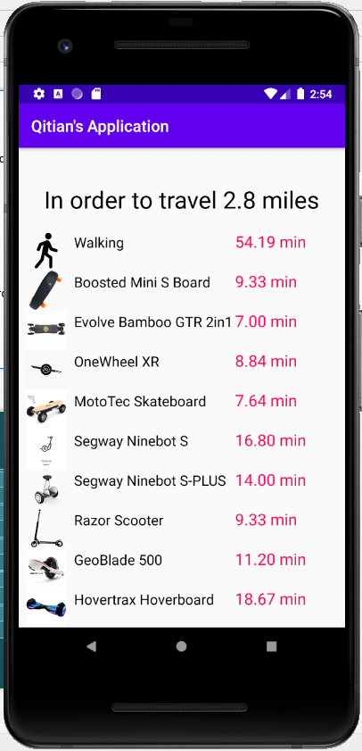
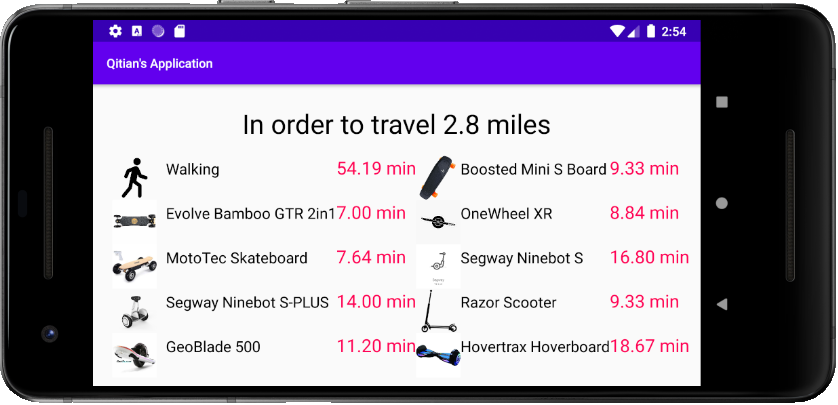
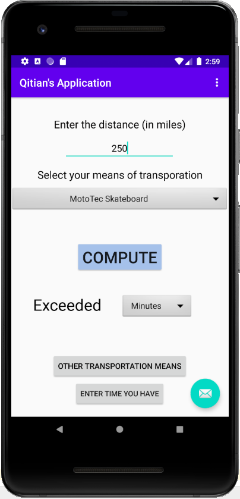
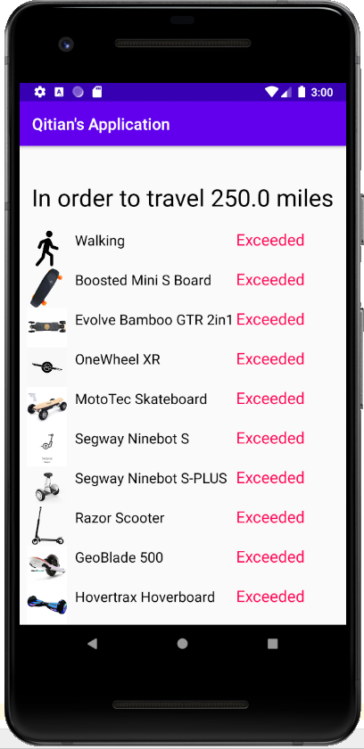
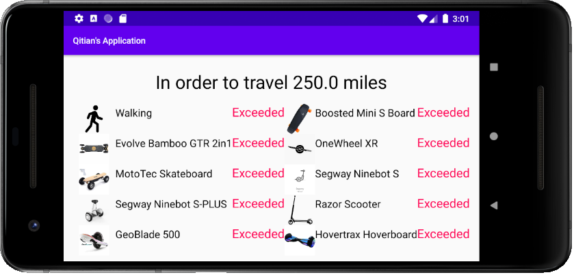
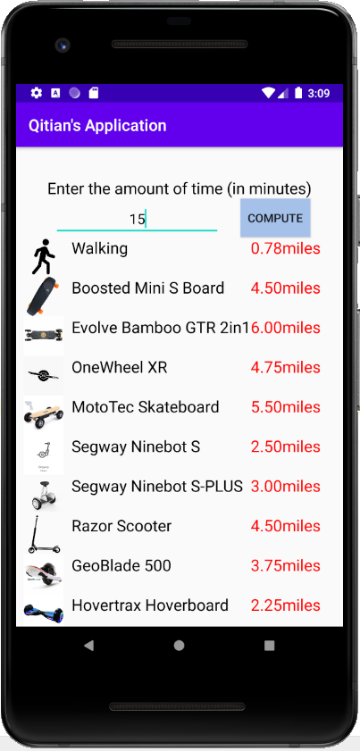
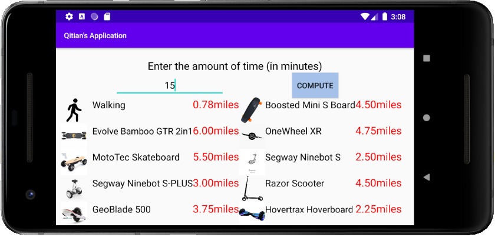

# electric-time
## Table of Contents
  - [User Manual (Video)](#User-Manual-Video)
  - [User Manual (Text and Images)](#User-Manual-Text-and-Images)
  - [Contact](#Contact)

## User Manual (Video)
https://www.youtube.com/watch?v=rDSYECEj4tk&t=2s

## User Manual (Text and Images)
Note: The user will see the view on the left in portrait mode, and the view on the right in landscape mode. 

When the user opens the application, an interface like the one below will pop up. 

 

Then the user can enter the *desired distance (in miles)* and select the *desired mode of transportation* from the dropdown menu. There are a total of 10 available choices. Then the user can pick the generated outcome to be represented in either hour (default) or minute. The output would be displayed to two decimal places after the user clicks `COMPUTE`. In the demo below, the user plans to travel 2.8 miles by OneWheel XR, and he wants the output to be in minutes. The generated number is 8.84 minutes. 

 

The user can click on `OTHER TRANSPORTATION MEANS` to learn how much time it would take to travel the same distance using other transports. 

 

If the user inputs distance that exceeds the range of the electric transport, `exceeded` would be displayed. 

 
 

On the other hand, the user can click on `Enter time you have` on the main interface to input how much time he has. Then he would be able to see how far they can travel on various transportation types after clicking `COMPUTE`. In the demo below, the user has 15 minutes. 

 

## Contact
Feel free to contact liaoqitian1024@gmail.com or find Qitian Liao on Slack if you have questions.
