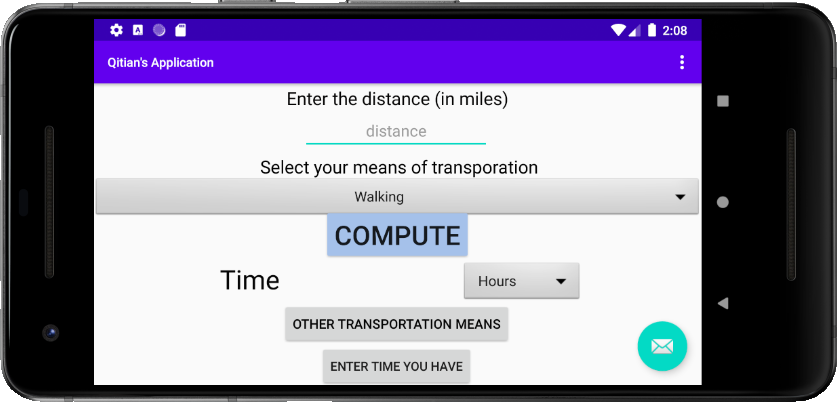

# electric-time

Note: The user will see the view on the left in portrait mode, and the view on the right in landscape mode. 

When the user opens the application, an interface like the one below will pop up. 

 

Then the user can enter the desired distance (in miles) and choose the desired mode of transportation from the dropdown menu. There are a total of 10 available choices. Then the user can pick the generated outcome to be represented in either hour (default) or minute. The output would be displayed to two decimal places. In the demo below, the user plans to travel 2.8 miles by OneWheel XR, and he wants the output to be in minutes. The generated number is 8.84 minutes. 

